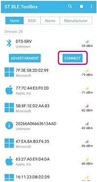
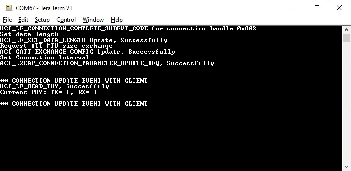
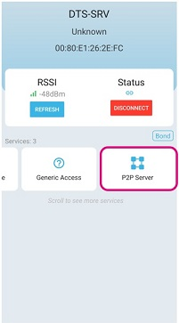
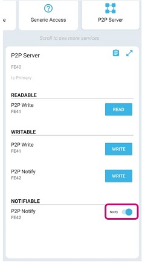
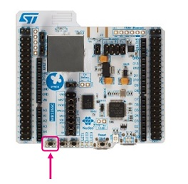
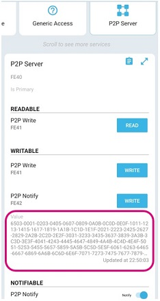
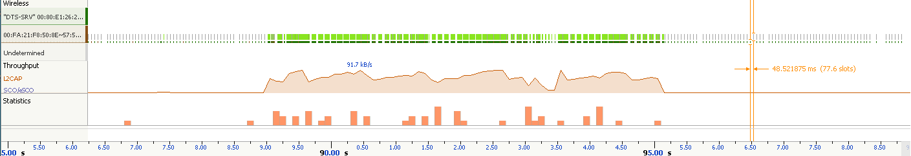
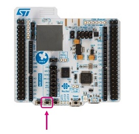
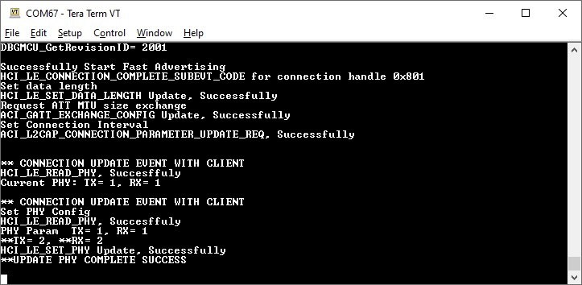
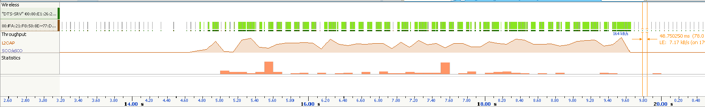

# STM32-Hotspot/BLE-Basic-DataThroughput-Server MCU Firmware Package, based on STM32CubeWB Release v1.13.1

## Example

This Hotspot FW package includes:
* Application example under "Projects\P-NUCLEO-WB55.Nucleo\Applications\BLE" called BLE_Basic_DataThroughput_Server.     
   * This example implements a basic BLE GATT Server for data throughput application via notification to a GATT Client using the BLE component.
   * The Client can be either another STM32WB55xx device or an iOS or Android Smartphone running a generic app like ST BLE Toolbox or LightBlue.
   * The Server device transmits a stream of Notification packets, and the Client device receives these packets.
   * The example also aims to demonstrate to the user how to configure the system (pinout, clocks, peripherals, utilities) and BLE WPAN middleware from STM32CubeMX to properly configure the BLE stack, and show how to schedule data transfers via Notifications from the user application to maximize throughput.       
   * Development tools, toolchains/compilers: STM32CubeMX v6.4.0, IAR EWARM V9.20.x
   * Supported Devices and hardware boards: NUCLEO-WB55RG
   * Known limitations: None

## Boards Needed

  * Two NUCLEO-WB55RG
    * [NUCLEO-WB55RG](https://www.st.com/en/evaluation-tools/nucleo-wb55rg.html)

## Users Guide

In order to make the program work, you must do the following:
  * Open your preferred toolchain (IAR EWARM or STM32CubeIDE)
  * Rebuild all files and load your image into target memory

One NUCLEO-WB55RG board is used, configured as the GAP peripheral and GATT Server. It supports Data transfer service with a transmission characteristic that supports notification.
Open a serial terminal connected to the Peripheral (ST Link Com Port, @115200 bauds).
At startup, the connection is established from a iOS or Android Smartphone Central Device (GATT Client) through an app like ST BLE Toolbox app.
 * The Peripheral (Gap Peripheral) device starts advertising.
 * The Smartphone (Gap Central) device scans and connects to the peripheral.

 

 * The client starts to search the data transfer service and characteristic.

 * The client enables the notification of the transmission characteristic.

 * On server side, the notification is started when the SW1 button is pushed (blue led is ON). The notifications can be stopped by disabling the notification on the app side.

 * On the Smartphone client receiving the current notification, the number of bytes can be logged.

 * A Bluetooth LE protocol sniffer (e.g. Ellisys Bluetooth Tracker) can be used to measure the actual data throughput. From the screenshot below, the data throughput achieved is 91.7kB/s (733kbps). Note that this measurement is using the 1M PHY.

 * The STM32WB also supports the 2M PHY, and the mode can be switched to it by pressing SW2 once the STM32WB is connected to the Smartphone in connected state.  

 

 * From the screenshot below, the data throughput achieved is 164kB/s (1.3Mbps).

## Troubleshooting

**Caution** : Issues and the pull-requests are **not supported** to submit problems or suggestions related to the software delivered in this repository. The BLE_Basic_DataThroughput_Server example is being delivered as-is, and not necessarily supported by ST.

**For any other question** related to the product, the hardware performance or characteristics, the tools, the environment, you can submit it to the **ST Community** on the STM32 MCUs related [page](https://community.st.com/s/topic/0TO0X000000BSqSWAW/stm32-mcus).
